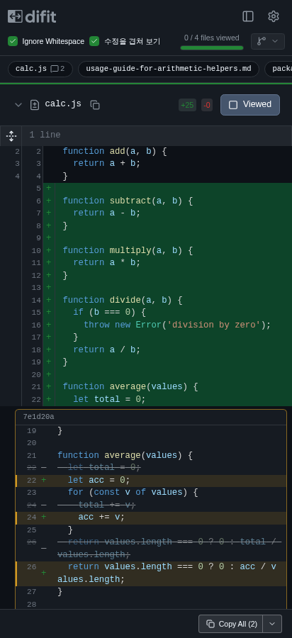
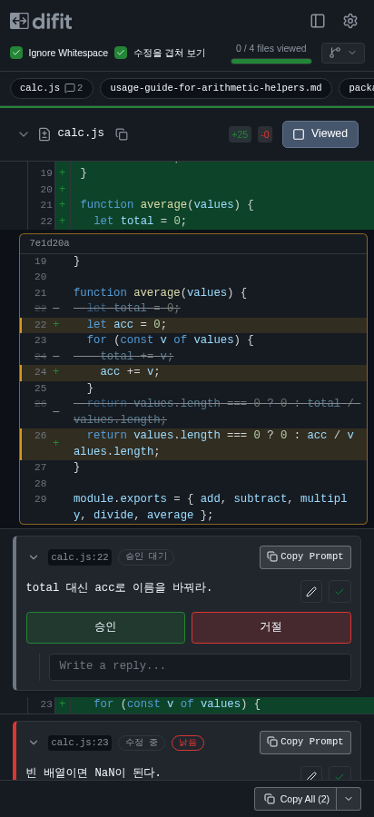
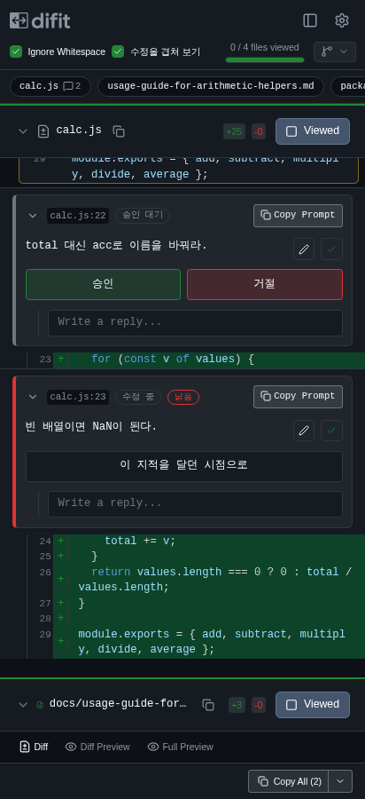
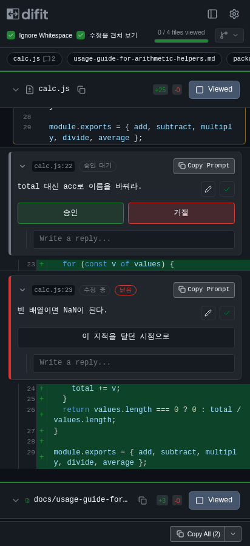
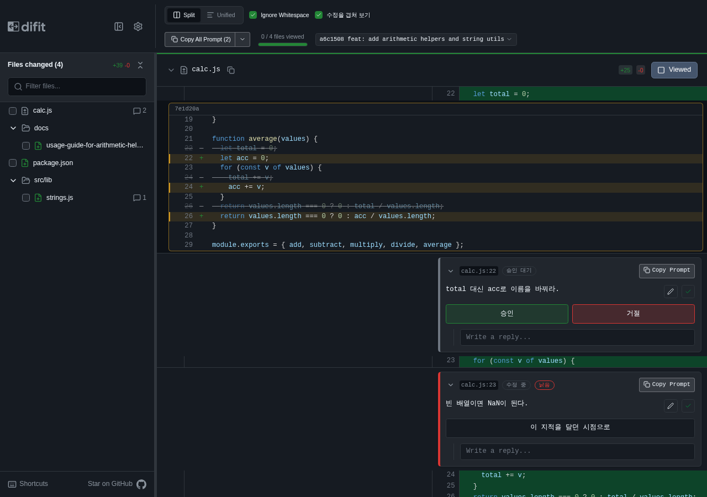
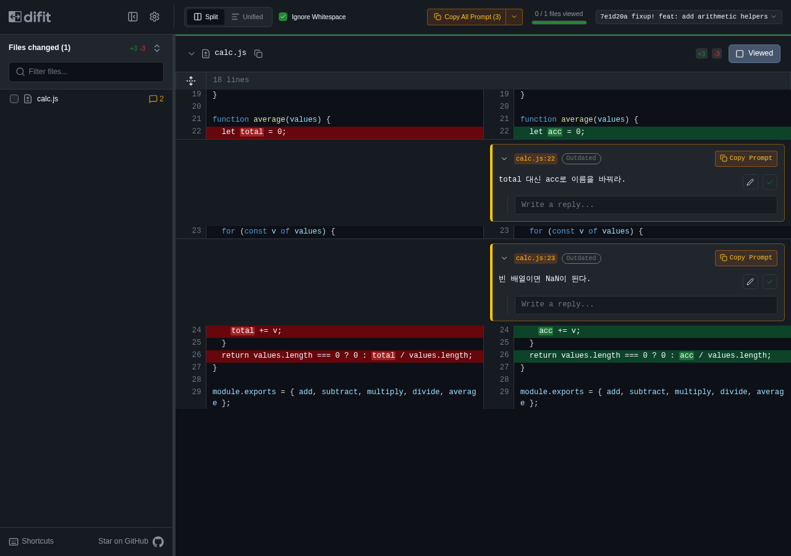

# 작업 인계 — 겹침 리뷰 (review-overlay), 2026-09-28

폰에서 이어 보려고 저장소에 올린 인계 파일이다. 트랙을 닫을 때 이 폴더를 지운다.

## 지금 상태

- 브랜치 `review-overlay` (origin = github.com/Inte-H/difit). 이 파일을 올린 커밋까지 일반 push 했다.
- 기록은 다시 쓰지 않기로 했다. 저녁 수정 커밋 접기와 이미 올린 커밋 메시지 고치기는 하지 않는다. 앞으로도 일반 push 만 한다.
- PRD: https://github.com/Inte-H/difit/issues/1 (오늘 결정과 확인 결과를 댓글로 달았다)

## 이슈 상태

| 이슈           | 내용                                                       | 상태                                           |
| -------------- | ---------------------------------------------------------- | ---------------------------------------------- |
| #2 #3 #4 #5 #7 | 분할 보기 카드, 위치 재탐색, CLI 상태, Copy Prompt, README | 실제 앱 확인 뒤 닫음                           |
| #8             | 낡은 지적의 "이 지적을 달던 시점으로" 단추                 | 닫음. 폰 폭 단추는 아래 `412-stale-button.png` |
| #9             | 승인·거절 때 실시간 알림 연결 유지                         | 닫음                                           |
| #10            | fixup 목록을 git 몇 번으로 만들기                          | 닫음                                           |
| #11            | 저장 형식 호환, 판정 API 본문 검증                         | 닫음                                           |
| #12            | 옛 리뷰에서 브라우저 뒤로 가기로 돌아오기                  | 닫음                                           |
| **#6**         | **폰 배치 (줄번호 30px, 파일 칩, 노란색 정리)**            | **구현 끝. 아래 스크린샷 승인만 남음**         |

## 사람이 할 일: #6 스크린샷 승인

아래는 합친 빌드를 SHA 로 열어 헤드리스 Chromium 으로 찍은 화면이다. 보고 괜찮으면 #6 에 승인 댓글을 달고 닫는다. 고칠 곳이 있으면 #6 에 적는다.

폰 412px, 헤더 아래 파일 칩과 30px 줄번호 열:

폰 412px, 겹침 카드. 노란색은 얹힌 수정에만 있고 경로 알약과 Copy Prompt·Copy All 은 중립색이다:

폰 412px, 낡은 지적의 "이 지적을 달던 시점으로" 단추:

폰 412px, 단추로 옛 리뷰에 갔다가 브라우저 뒤로 가기로 돌아온 화면:

PC 1280px 분할 보기. 배치는 전과 같고 색만 중립색으로 바뀌었다:

HEAD 로 연 리뷰. 원래 difit 색 그대로다:

## 오늘 한 것

- 실제 앱 확인: 확인 항목 아홉 개 모두 통과. 이 결과로 #2·#3·#4·#5·#7 을 닫았다.
- 새로 넣은 것 (모두 테스트 포함, vitest 969 통과·2 건너뜀, oxlint·knip·oxfmt 통과):
  - fixup 목록을 fixup 수와 상관없이 git 세 번으로 만든다 (병합 커밋이 있으면 네 번).
  - 지적 새로고침 함수가 바뀌어도 실시간 알림 연결을 끊지 않는다. 판정이 그대로면 다시 저장하지 않는다.
  - "이 지적을 달던 시점으로"로 간 뒤 브라우저 뒤로 가기로 원래 리뷰에 돌아온다.
  - 폰 배치: 줄번호 30px, 파일 칩, 폰에서 파일 서랍은 닫힌 채 시작.
  - SHA 로 연 리뷰에서는 노란색을 겹쳐 보인 수정에만 쓴다.
  - README: `--trailer` 를 모르는 오래된 git 에서는 `-m "Review-Thread: <id>"` 로 붙인다.

## 알아 둘 것 (버그는 아님)

- 겹침 카드의 줄번호는 fixup 커밋의 파일 기준이다. 앞의 fixup 이 줄을 밀면 지적 줄 번호와 다르게 보인다.
- fixup 이 지적 줄 위에 줄만 끼우면 카드에 지적 줄 자체는 보이지 않는다.
- 노란색 정리는 SHA 로 연 리뷰에서만이다. HEAD·브랜치로 연 리뷰는 원래 difit 색이다.
- 커밋 선택기로 바꾼 리뷰 대상은 브라우저 기록에 남지 않는다.
- PC 폭에서 커밋 제목이 길면 SHA 로 연 리뷰의 헤더가 두 줄로 넘어간다. "수정을 겹쳐 보기" 체크박스가 더해진 만큼 헤더 오른쪽 묶음이 넓어져서다.
- 서버에서 받은 지적 목록이 그대로여도 알림이 올 때마다 브라우저 저장소에 지적을 한 번 다시 쓴다.

## 남은 일

1. #6 스크린샷 승인 (사람).
2. 트랙 닫기: 설계 문서 `fixup-overlay-review.md` 의 "앵커 커밋은 지적마다 둘 필요 없다" 문단이 판정과 어긋나니 고치거나 문서를 처분한다. 이 `docs/handoff/` 폴더를 지운다. 회고.
3. 정할 것: `fix/app-test-refresh-flake` (main 에서도 나던 `App.test.tsx` 새로고침 테스트 실패 수정, origin 에 있음) 를 upstream 에 PR 로 낼지. README 한국어 절을 `README.ko.md` 로 옮길지.

## 이 PC 환경

- git 2.25 라 lefthook 이 설치되지 않는다. `corepack pnpm` 은 멈추므로 `node_modules/.bin/` 에서 직접 실행한다.
- 검사: `vitest run`, `oxlint . --type-aware --type-check --deny-warnings --report-unused-disable-directives`, `knip --use-tsconfig-files`, `oxfmt --check .`
- `~/difit` 안에 worktree 를 만들면 knip 이 바깥 `~/difit/tsconfig.json` 을 읽다가 멈춘다. 그때는 `src/` 에서 `knip --directory <worktree> --use-tsconfig-files` 로 돌린다.
